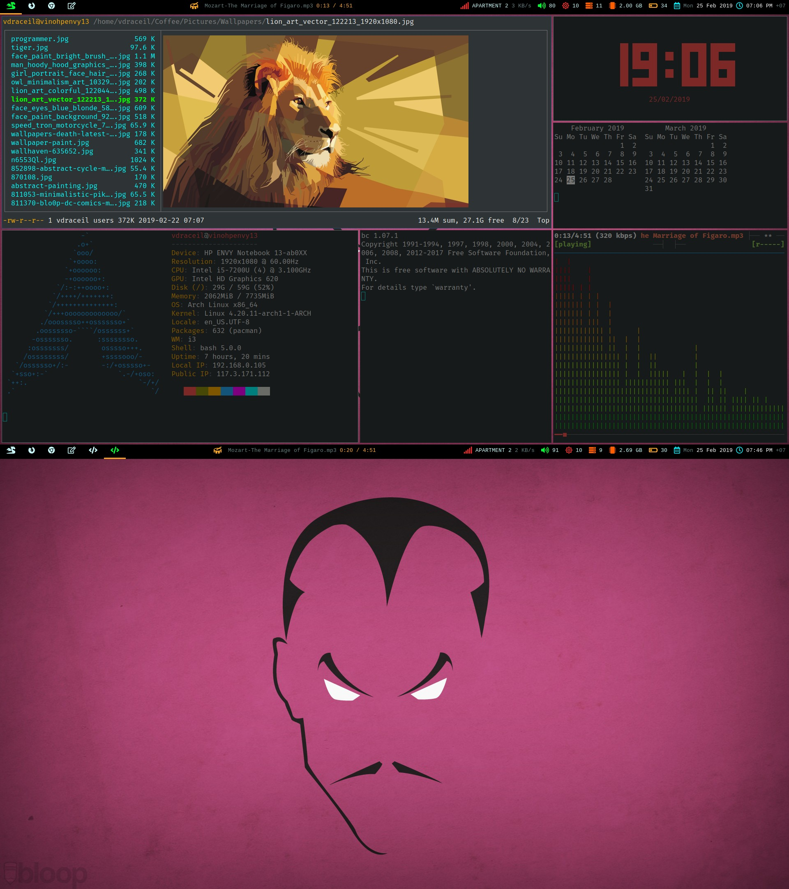

## DOT FILES

All of these dot files collectively define my working environment (bash, vim, i3, git, etc.), which I use everyday

## How does my setup look?


## Setup

 - Get the dotfiles and execute install.sh to create all symlinks in your $HOME dir
 - However, if you already have any existing files, they will not be replaced (unless you use the `--force` flag)
 - Use `--sudo` flag if you want to make systemd links under `/etc/`

```sh
$ git clone git@github.com:vdraceil/dotfiles.git
$ ./dotfiles/install.sh
```

 - `pip3 uninstall greenlet` followed by `pip3 install --user pynvim` - required for deoplete Plugin
 - Next, open vim. It'll take care of installing all the plugins
 - After the installation completes, dismiss the Vundle Preview Split and check if vim looks visually alright (Check Airline bar, Tab bar, Colorscheme, etc.)

```sh
$ vim
```

 - Check the bash prompt color change based on success/failure of the previous command

## Customization

 - `.bashrc` - additional customization can be done by introducing a new local overrides file ~/.local/.bashrc
